<h1 align="center">CSE0613311 - Artificial Intelligence</h1>

- [1. Introduction to Artificial Intelligence:](#1-introduction-to-artificial-intelligence)
  - [1.1. What is AI:](#11-what-is-ai)
  - [1.2. Main Goals of AI:](#12-main-goals-of-ai)
  - [1.3. Why AI:](#13-why-ai)
  - [1.4. Foundation of AI:](#14-foundation-of-ai)
  - [1.5. A Short History of AI:](#15-a-short-history-of-ai)
  - [1.6. What Can AI Do:](#16-what-can-ai-do)
  - [1.7. What Can’t AI Systems Do Yet:](#17-what-cant-ai-systems-do-yet)
  - [1.8. Big Questions:](#18-big-questions)
  - [1.9. Who Does AI:](#19-who-does-ai)
  - [1.10. Four Goals of AI:](#110-four-goals-of-ai)
  - [1.11. What is Turing Test \& Loebner Test:](#111-what-is-turing-test--loebner-test)
  - [1.12. Purpose of Turing Test \& Loebner Test:](#112-purpose-of-turing-test--loebner-test)
  - [1.13. How Turing Test \& Loebner Test Work:](#113-how-turing-test--loebner-test-work)
  - [1.14. What is Heuristic System:](#114-what-is-heuristic-system)
  - [1.15. Reasoning Areas Where AI is Used:](#115-reasoning-areas-where-ai-is-used)
  - [1.16. Strong AI vs Weak AI:](#116-strong-ai-vs-weak-ai)
- [2. Agent and Environment:](#2-agent-and-environment)
  - [2.1. What is Agent:](#21-what-is-agent)
  - [2.2. Rationality and Autonomy:](#22-rationality-and-autonomy)
    - [2.2.1. Rationality:](#221-rationality)
    - [2.2.2. Autonomy:](#222-autonomy)
  - [2.3. Types of Agents:](#23-types-of-agents)
    - [2.3.1. Simple Reflex Agent:](#231-simple-reflex-agent)
    - [2.3.2. Model-Based Reflex Agent:](#232-model-based-reflex-agent)
    - [2.3.3. Goal-Based Agent:](#233-goal-based-agent)
    - [2.3.4. Utility-Based Agent:](#234-utility-based-agent)
    - [2.3.5. Learning Agent:](#235-learning-agent)
  - [2.4. Properties of Environments:](#24-properties-of-environments)
- [3. Searching Algorithms:](#3-searching-algorithms)
  - [3.1. Uninformed Search:](#31-uninformed-search)
    - [3.1.1. Uninformed Search Algorithms:](#311-uninformed-search-algorithms)
      - [3.1.1.1. Breadth-First Search (BFS):](#3111-breadth-first-search-bfs)
      - [3.1.1.2. Depth-First Search (DFS):](#3112-depth-first-search-dfs)
      - [3.1.1.3. Uniform Cost Search (UCS):](#3113-uniform-cost-search-ucs)
      - [3.1.1.4. Depth-Limited Search (DLS):](#3114-depth-limited-search-dls)
      - [3.1.1.5. Iterative Deepening Search (IDS)](#3115-iterative-deepening-search-ids)
      - [3.1.1.6. Quick Recap:](#3116-quick-recap)
  - [3.2. Informed Search:](#32-informed-search)
    - [3.2.1. Informed Search Algorithms:](#321-informed-search-algorithms)
    - [3.2.2. Informed Search Algorithms:](#322-informed-search-algorithms)
      - [3.2.2.1. Greedy Best-First Search:](#3221-greedy-best-first-search)
      - [3.2.2.2. A\* (A-Star) Search:](#3222-a-a-star-search)
      - [3.2.2.3. Quick Recap:](#3223-quick-recap)
  - [3.3. Local Search:](#33-local-search)
    - [3.3.1. Local Search Algorithms:](#331-local-search-algorithms)
      - [3.3.1.1. Hill Climbing:](#3311-hill-climbing)
  - [3.4. Difference Between Uninformed, Informed, and Local Search:](#34-difference-between-uninformed-informed-and-local-search)
- [4. Home Work 1:](#4-home-work-1)
  - [4.1. Question 1:](#41-question-1)
    - [4.1.1. Answer:](#411-answer)
  - [4.2. Question 2:](#42-question-2)
    - [4.2.1. Answer:](#421-answer)
  - [4.3. Question 3:](#43-question-3)
    - [4.3.1. Answer:](#431-answer)
- [5. CT1 SET A:](#5-ct1-set-a)
  - [5.1. Ans to the Question No. 1:](#51-ans-to-the-question-no-1)
  - [5.2. Ans to the Question No. 2:](#52-ans-to-the-question-no-2)
  - [5.3. Ans to the Question No. 3:](#53-ans-to-the-question-no-3)
- [6. CT1 SET B:](#6-ct1-set-b)

# 1. Introduction to Artificial Intelligence:

## 1.1. What is AI:
Artificial Intelligence (AI) is a branch of computer science that creates systems that capable of learning, reasoning, problem-solving, and making decisions in ways that normally require human intelligence.


## 1.2. Main Goals of AI: 

- Learning
- Reasoning
- Problem-Solving
- Perception
- Natural Language Understanding
- Decision-Making
- Automation
- Creating Intelligent Agents

## 1.3. Why AI:
- Automation: Automates repetitive and time-consuming tasks.
- Efficiency: Performs tasks faster and more efficiently than humans.
- Accuracy: Reduces human errors and improves consistency.
- Data Analysis: Processes and analyzes large amounts of data to find useful insights.
- Decision-Making: Helps humans make better decisions by providing intelligent recommendations.

## 1.4. Foundation of AI:
- Computer Science & Engineering
- Mathematics
- Psychology & Cognitive Science
- Philosophy
- Biology
- Neuroscience
- Linguistics
- economics


## 1.5. A Short History of AI:
| Year          | Milestone                           |
| ------------- | ----------------------------------- |
| 1943          | First artificial neuron model       |
| 1950          | Turing Test proposed                |
| 1956          | Birth of AI at Dartmouth Conference |
| 1970s–1980s   | Expert Systems                      |
| 1988–1993     | AI Winter                           |
| 1990s         | Statistical AI                      |
| 2010s–Present | Deep Learning & Generative AI       |


## 1.6. What Can AI Do:
- Learn from data
- Solve problems
- Understand language
- Recognize images and speech
- Make decisions
- Automate tasks
- Make predictions


## 1.7. What Can’t AI Systems Do Yet:

- Truly understand like humans.
- Possess consciousness or self-awareness.
- Think and reason like humans in every situation.
- Make perfect decisions.
- Fully replace humans.


## 1.8. Big Questions: 

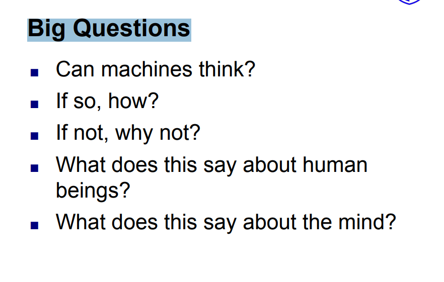


| Question                           | Simple Answer                                                                                                      |
| ---------------------------------- | ------------------------------------------------------------------------------------------------------------------ |
| Can machines think?                | AI researchers debate this; machines can perform intelligent tasks, but whether they truly think is controversial. |
| If so, how?                        | By processing information, learning from data, and making decisions using algorithms.                              |
| If not, why not?                   | Because they lack consciousness, emotions, and true understanding.                                                 |
| What does this say about humans?   | It helps us understand what makes human intelligence unique.                                                       |
| What does this say about the mind? | It raises questions about whether the mind works like a computer and whether consciousness can be replicated.      |


## 1.9. Who Does AI:

- AI researchers / scientists: Design new AI theories, algorithms, and models to improve intelligence systems.
- Software engineers: Build and implement AI applications and turn research ideas into real-world software.
- Data scientists: Collect, clean, and analyze data to train AI models and improve their accuracy.
- Technology companies: Develop, deploy, and scale AI products for real users (apps, services, tools).
- Universities and research labs: Conduct academic research, discover new AI methods, and train future experts.

## 1.10. Four Goals of AI:
- Learning: Enable machines to learn from data and improve performance over time.
- Reasoning: Allow machines to make logical decisions based on available information.
- Problem Solving: Help machines find solutions to complex or real-world problems.
- Perception: Enable machines to understand and interpret input from the environment (images, sound, text).


## 1.11. What is Turing Test & Loebner Test: 

- Turing Test: The Turing Test was proposed by Alan Turing. It is a test to check whether a machine can show human-like intelligence in conversation.
- Loebner Test: The Loebner Test (Loebner Prize Competition) is a real-world version of the Turing Test. Means it is an annual competition where judges interact with both humans and AI chat systems.

## 1.12. Purpose of Turing Test & Loebner Test:

- Turing Test: To evaluate whether a machine can imitate human intelligence well enough to be indistinguishable from a human in conversation.
- Loebner Test: To measure how closely AI can simulate human conversation in practice.

## 1.13. How Turing Test & Loebner Test Work:
- Turing Test: A human judge chats with two hidden participants: one human and one machine (AI). If the judge cannot reliably tell which one is the machine, the AI is said to pass the test.
- Loebner Test: Judges have conversations and try to identify which participant is the machine. The AI that most closely mimics human conversation performs best.


## 1.14. What is Heuristic System: 
A heuristic system is an AI approach that solves problems using experience-based rules or “rules of thumb” instead of trying every possible solution. For example: 
- In chess AI, instead of analyzing every possible move, the system uses heuristics to choose strong moves quickly.
- In GPS navigation, it quickly finds a good route instead of checking all possible routes.

## 1.15. Reasoning Areas Where AI is Used: 
- Medical diagnosis (finding diseases)
- Expert systems (decision support in law, finance, medicine)
- Game playing (chess, strategy games)
- Planning & scheduling (delivery routes, logistics)
- Natural language reasoning (chatbots, Q&A systems)

## 1.16. Strong AI vs Weak AI: 
| Feature       | Weak AI               | Strong AI                              |
| ------------- | --------------------- | -------------------------------------- |
| Scope         | Limited tasks         | Any task like humans                   |
| Intelligence  | Narrow                | General                                |
| Understanding | No real understanding | Human-like understanding (theoretical) |
| Existence     | Exists today          | Not yet built                          |

# 2. Agent and Environment:
## 2.1. What is Agent: 
An agent is anything that can perceive its environment through sensors and act upon that environment through actuators to achieve a goal. For examples:
- Human: Eyes and ears (sensors), hands and legs (actuators).
- Robot: Cameras and sensors (sensors), motors and wheels (actuators).
- AI Software: Input data (sensors), generated outputs or actions (actuators).

## 2.2. Rationality and Autonomy:
### 2.2.1. Rationality: 
A rational agent chooses the action that is expected to achieve the best outcome based on its knowledge and goals. For example: 
- A GPS navigation system selects the shortest or fastest route to a destination.

### 2.2.2. Autonomy: 
Autonomy is the ability of an agent to operate independently without constant human intervention. For example: 
- A self-driving car can make driving decisions on its own.

Note: There are two Levels of Autonomy:
1. Low autonomy: Requires frequent human control.
2. High autonomy: Makes most decisions independently.

## 2.3. Types of Agents:
1. Simple Reflex Agent: 
2. Model-Based Reflex Agent
3. Goal-Based Agent
4. Utility-Based Agent
5. Learning Agent

### 2.3.1. Simple Reflex Agent:
Acts only on the current percept using condition-action rules.

Example: 
- If room is dirty → Vacuum.
- If room is clean → Do nothing.

Characteristics:
- No memory
- No knowledge of past states

### 2.3.2. Model-Based Reflex Agent:
Maintains an internal model (memory) of the environment.

Example:
- A robot remembers which rooms it has already cleaned.

Characteristics:
- Uses current percept + internal state
- Better than simple reflex agents

### 2.3.3. Goal-Based Agent:
Chooses actions based on achieving specific goals.

Example:
- A navigation system finding a route to a destination.

Characteristics:
- Considers future outcomes
- Uses search and planning

### 2.3.4. Utility-Based Agent:
Chooses actions that maximize a utility (preference) measure.

Example:
- A ride-sharing app choosing the fastest and cheapest route.

Characteristics:
- Evaluates multiple possible outcomes
- Selects the most beneficial one

### 2.3.5. Learning Agent:
Improves performance through experience.

Example:
- A spam filter that becomes better at detecting spam emails over time.

Characteristics:
- Learns from data and feedback
- Adapts to new situations

## 2.4. Properties of Environments: 
The environment in which an agent operates can be described using several properties such as: 
1. Fully Observable vs Partially Observable:
   - Fully observable: Agent can perceive the complete state of the environment. For example: chess game.
   - Partially observable: Agent cannot see the entire environment.. For example: poker game.
2. Deterministic vs Stochastic:
   - Deterministic: Actions always produce predictable results. For example: Solving a math problem
   - Stochastic: Actions may have uncertain outcomes. For example: Weather forecasting
3. Episodic vs Sequential:
   - Episodic: Each decision is independent. For example: Image classification.
   - Sequential: Current decisions affect future decisions. For example: Chess. 
4. Static vs Dynamic:
   - Static: Environment does not change while the agent is making decisions. For example: Crossword puzzle.
   - Dynamic: Environment can change during decision-making. For example: Driving a car.
5. Discrete vs Continuous:
   - Discrete: Finite number of states and actions. For example: Chess.
   - Continuous: Infinite range of states or actions. For example: Autonomous driving.
6. Single-Agent vs Multi-Agent:
   - Single-Agent: Only one agent operates in the environment. For example: Sudoku solver.
   - Multi-Agent: Multiple agents interact with each other. For example: Football game.


# 3. Searching Algorithms:
In Artificial Intelligence, search algorithms are often divided into two categories:
1. Uninformed Search
2. Informed Search 
   
## 3.1. Uninformed Search:
Uninformed search algorithms have no extra information about how close a state is to the goal. They only know:
- The initial state
- The possible actions
- The goal test

**Characteristics:**
- No heuristic knowledge is used.
- Searches blindly through possible states.
- Usually explores more nodes.
- Can be slower for large problems.

**Example:**
Imagine finding a treasure in a maze(গোলকধাঁধা) without any clues. You keep checking paths until you find it.

```
Start
  |
 / \
A   B
|   |
C   Goal
```

### 3.1.1. Uninformed Search Algorithms:
#### 3.1.1.1. Breadth-First Search (BFS):
BFS explores nodes level by level. It visits all nodes at the current depth before moving to the next depth.

**How it Works:**
```
      A
    /   \
   B     C
  / \   / \
 D   E F   G
```
**Traversal order:** `A → B → C → D → E → F → G`

**Data Structure:** Queue (FIFO: First In, First Out)

**Steps:** 
- Start at the root node.
- Visit the node.
- Add its children to the queue.
- Remove the first node from the queue and repeat.

**Advantages:**
- Complete (finds a solution if one exists).
- Finds the shortest path when all costs are equal.

**Disadvantages:**
- Uses a lot of memory.
- Slow for deep trees.

**Time & Space Complexity:**
| Time Complexity | Space Complexity |
| --------------- | ---------------- |
| O(bᵈ)           | O(bᵈ)            |

where,
- b = branching factor
- d = depth of shallowest goal

#### 3.1.1.2. Depth-First Search (DFS):
DFS explores one branch as deep as possible before backtracking.

**How it Works:**
```
      A
    /   \
   B     C
  / \   / \
 D   E F   G
```
**Traversal order:** `A → B → D → E → C → F → G`

**Data Structure:** Stack (LIFO: Last In, First Out) Or recursion

**Steps:** 
- Visit a node.
- Go to its first child.
- Continue deeper until no child exists.
- Backtrack and explore remaining branches.

**Advantages:**
- Requires less memory.
- Easy to implement.

**Disadvantages:**
- May get stuck in deep or infinite paths.
- Does not guarantee the shortest path.

**Time & Space Complexity:**
| Time Complexity | Space Complexity |
| --------------- | ---------------- |
| O(bᵐ)           | O(bm)            |

where,
- m = maximum depth

#### 3.1.1.3. Uniform Cost Search (UCS):
UCS expands the node with the lowest path cost first. Unlike BFS, UCS considers edge costs.

**How it Works:**
```
      A
    /   \
   B(2) C(1)
    |     |
 Goal(3) Goal(10)
```

**Possible paths:**
```
A → B → Goal = 5
A → C → Goal = 11
```

**UCS chooses:**
```
A → B → Goal
```
because cost 5 is lower.

**Data Structure:** Priority Queue (Min Heap)

**Steps:** 
- Start at the root node.
- Visit the lowest-cost node.
- Add its children with their costs.
- Choose the lowest-cost node again.
- Repeat until the goal is found.

**Advantages:**
- Complete.
- Finds the optimal (lowest-cost) solution.

**Disadvantages:**
- Can use large memory.
- May explore many nodes.

**Time & Space Complexity:**
| Time Complexity                           | Space Complexity               |
| ----------------------------------------- | ------------------------------ |
| Depends on path costs; often exponential. | Exponential in the worst case. |

#### 3.1.1.4. Depth-Limited Search (DLS):
DLS is a DFS variant that searches only up to a specified depth limit.

**How it Works:**
```
        A
      /   \
     B     C
    / \
   D   E
  /
 F
```

Depth Limit = 2

**Traversal order:** `A → B → D → E → C`
Note: (F is not visited because it is beyond the depth limit.)

**Data Structure:** Stack (LIFO) or recursion

**Steps:** 
- Start at the root node.
- Visit the node.
- Go deeper to its children.
- Stop when the depth limit is reached.
- Backtrack and explore other branches.

**Advantages:**
- Uses less memory than BFS.
- Prevents searching infinitely deep paths.

**Disadvantages:**
- May miss the goal if it is beyond the depth limit.
- Does not guarantee the shortest path.

**Time & Space Complexity:**
| Time Complexity | Space Complexity |
| --------------- | ---------------- |
| O(bˡ)           | O(bl)            |

where,
- b = branching factor
- l (mama it's not 1, its L means limit) = depth limit

#### 3.1.1.5. Iterative Deepening Search (IDS)
IDS combines DFS and BFS. It repeatedly runs DLS with increasing depth limits until the goal is found.

**How it Works:**
```
        A
      /   \
     B     C
    / \   / \
   D   E F   G
```
**Traversal order:**
- Depth Limit = 0: `A`
- Depth Limit = 1: `A → B → C`
- Depth Limit = 2: `A → B → D → E → C → F → G`

The search continues with larger depth limits until the goal is found.


**Data Structure:** Stack (LIFO) or recursion

**Steps:** 
- Start with depth limit 0.
- Perform DLS.
- If the goal is not found, increase the depth limit.
- Run DLS again.
- Repeat until the goal is found.

**Advantages:**
- Complete.
- Finds the shortest path when all costs are equal.
- Uses less memory than BFS.

**Disadvantages:**
- Repeats searching the same nodes multiple times.
- Can be slower than BFS.

**Time & Space Complexity:**
| Time Complexity | Space Complexity |
| --------------- | ---------------- |
| O(bᵈ)           | O(bd)            |

where,
- b = branching factor
- d = depth of shallowest goal

#### 3.1.1.6. Quick Recap: 
| Algorithm | Strategy                                  | Data Structure           | Complete?                    | Optimal?                     |
| --------- | ----------------------------------------- | ------------------------ | ---------------------------- | ---------------------------- |
| BFS       | Explore level by level                    | Queue (FIFO)             | Yes                          | Yes (if all costs are equal) |
| DFS       | Go as deep as possible                    | Stack (LIFO) / Recursion | No (for infinite depth)      | No                           |
| UCS       | Choose the lowest-cost path               | Priority Queue           | Yes                          | Yes                          |
| DLS       | DFS with a depth limit                    | Stack (LIFO) / Recursion | No (if goal is beyond limit) | No                           |
| IDS       | Repeatedly run DLS with increasing limits | Stack (LIFO) / Recursion | Yes                          | Yes (if all costs are equal) |

## 3.2. Informed Search: 
Informed search algorithms use additional knowledge (heuristics) to estimate how close a state is to the goal.
  - A heuristic is a rule or estimate that helps decide which path looks more promising.

**Characteristics:**
- Uses heuristic information.
- Searches more intelligently.
- Usually explores fewer nodes.
- Often faster than uninformed search.

**Example:**
Imagine finding a treasure in a maze while having a map that shows which direction is closer to the treasure. 

```
Start → A → B → Goal (Most close direction to goal)
Start → A → B → C → D → E → Goal
Start → A → B → C → D → E → F → G → H → I → J → Goal
```

### 3.2.1. Informed Search Algorithms:

### 3.2.2. Informed Search Algorithms:

#### 3.2.2.1. Greedy Best-First Search:

Greedy Best-First Search chooses the node that appears closest to the goal according to a heuristic value.

**Heuristic Function:**

```
h(n) = Estimated cost from node n to the goal
```

**How it Works:**

```
        A
      /   \
   B(4)   C(2)
   /         \
Goal(1)    Goal(5)
```

The numbers represent heuristic values h(n).

**Greedy chooses:**

```
A → C
```

because `h(C) = 2` is smaller than `h(B) = 4`.

**Data Structure:** Priority Queue (ordered by heuristic value h(n))

**Steps:**

* Start at the root node.
* Check the heuristic value of each child.
* Choose the node that seems closest to the goal.
* Visit that node.
* Repeat until the goal is found.

**Advantages:**

* Often faster than uninformed search.
* Usually explores fewer nodes.

**Disadvantages:**

* Not guaranteed to find the shortest path.
* Can be misled by a poor heuristic.

**Time & Space Complexity:**

| Time Complexity | Space Complexity |
| --------------- | ---------------- |
| O(bᵐ)           | O(bᵐ)            |

where,

* b = branching factor
* m = maximum depth

---

#### 3.2.2.2. A* (A-Star) Search:

A* Search combines the actual path cost and the heuristic estimate to find the best path.

**Evaluation Function:**

```
f(n) = g(n) + h(n)
```

where,

* g(n) = actual cost from the start node to n
* h(n) = estimated cost from n to the goal
* f(n) = total estimated cost

**How it Works:**

```
        A
      /   \
   B       C
 g=2     g=1
 h=3     h=10
```

**Calculate f(n):**

```
f(B) = 2 + 3 = 5
f(C) = 1 + 10 = 11
```

**A* chooses:**

```
A → B
```

because `f(B) = 5` is smaller than `f(C) = 11`.

**Data Structure:** Priority Queue (ordered by f(n))

**Steps:**

* Start at the root node.
* Calculate f(n) = g(n) + h(n).
* Choose the node with the lowest f(n).
* Visit that node.
* Update costs for its children.
* Repeat until the goal is found.

**Advantages:**

* Complete.
* Finds the optimal path when the heuristic is admissible.
* Usually explores fewer nodes than UCS.

**Disadvantages:**

* Uses a lot of memory.
* Performance depends on the quality of the heuristic.

**Time & Space Complexity:**

| Time Complexity               | Space Complexity              |
| ----------------------------- | ----------------------------- |
| Exponential in the worst case | Exponential in the worst case |

#### 3.2.2.3. Quick Recap:
| Algorithm                | Strategy                                     | Uses Heuristic?   | Complete? | Optimal?                        |
| ------------------------ | -------------------------------------------- | ----------------- | --------- | ------------------------------- |
| Greedy Best-First Search | Choose node that appears closest to the goal | Yes (h(n))        | No        | No                              |
| A* Search                | Choose node with lowest total estimated cost | Yes (g(n) + h(n)) | Yes       | Yes (with admissible heuristic) |


## 3.3. Local Search:

Local search algorithms focus on finding a good solution by moving from one state to a neighboring state. Unlike other search algorithms, they usually do not keep track of the full path from the start state to the goal state.

**Characteristics:**
- Uses only the current state and its neighbors.
- Requires very little memory.
- Often used for optimization problems.
- Does not usually guarantee the optimal solution.
- Can get stuck in local optima.

**Example:**
Imagine trying to reach the highest point on a mountain while standing somewhere on it. At each step, you move to the highest neighboring point until no higher neighbor exists.

```
      10
     /  \
   15    20
         / \
       25  18
```

Traversal:

```
10 → 20 → 25
```

The algorithm stops at 25 because there is no higher neighboring state.

### 3.3.1. Local Search Algorithms:

#### 3.3.1.1. Hill Climbing:

Hill Climbing repeatedly moves to the neighboring state with the best value.

**How it Works:**

```
      5
     / \
    8   7
   /
 10
```

**Traversal:**

```
5 → 8 → 10
```

The algorithm always chooses the best neighboring state.

**Steps:**
- Start with an initial state.
- Evaluate neighboring states.
- Move to the best neighbor.
- Repeat until no better neighbor exists.

**Advantages:**
- Simple to implement.
- Uses very little memory.
- Often finds a good solution quickly.

**Disadvantages:**
- Can get stuck in local optima.
- Can get stuck on plateaus.
- Does not guarantee the optimal solution.

**Time & Space Complexity:**

| Time Complexity | Space Complexity |
| --------------- | ---------------- |
| O(∞) Worst Case | O(1)             |

---


## 3.4. Difference Between Uninformed, Informed, and Local Search:

| Feature        | Uninformed Search   | Informed Search          | Local Search                                          |
| -------------- | ------------------- | ------------------------ | ----------------------------------------------------- |
| Knowledge Used | No extra knowledge  | Uses heuristic knowledge | Uses current state and neighbors                      |
| Search Style   | Blind search        | Guided search            | Optimization search                                   |
| Path Tracking  | Yes                 | Yes                      | Usually No                                            |
| Memory Usage   | Medium to High      | Medium to High           | Low                                                   |
| Speed          | Usually slower      | Usually faster           | Often very fast                                       |
| Goal           | Find a path to goal | Find a path efficiently  | Find a good/optimal state                             |
| Examples       | BFS, DFS, UCS       | Greedy Search, A*        | Hill Climbing, Simulated Annealing, Genetic Algorithm |

# 4. Home Work 1:
## 4.1. Question 1: 
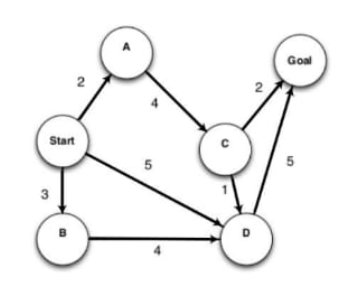 

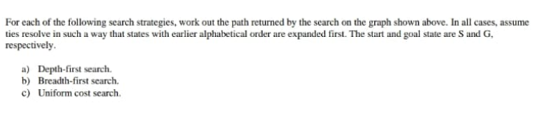

**Note:** Mama if you look closely to the graph you will see a pattern like this: 

```
START → A (2)
START → B (3)
START → D (5)
A → C (4)
B → D (4)
C → D (1)
C → G (2)
D → G (5)
```

and here our goal is to try to resolve the graph in such a way that states with earlier alphabetical order and expanded first.

### 4.1.1. Answer:

- Depth-First Search:  

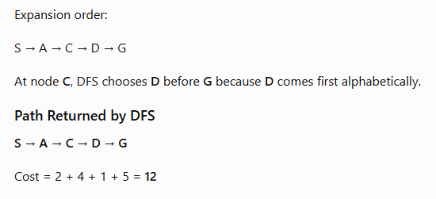

- Breadth-First Search:

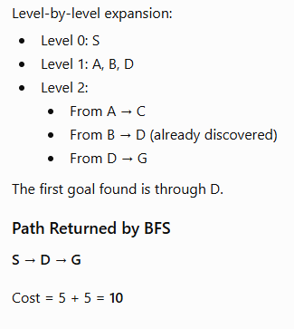

- Uniform Cost Search:

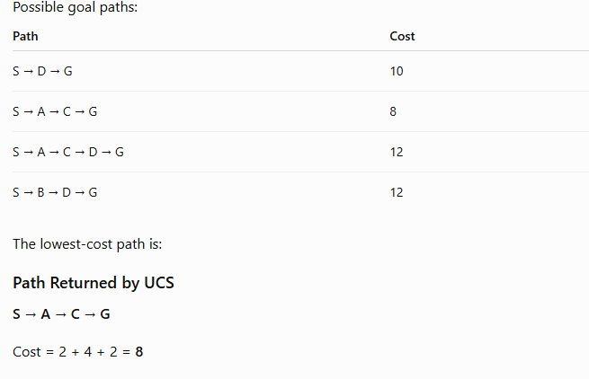

## 4.2. Question 2: 

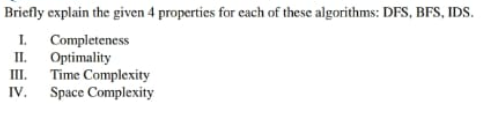
### 4.2.1. Answer:
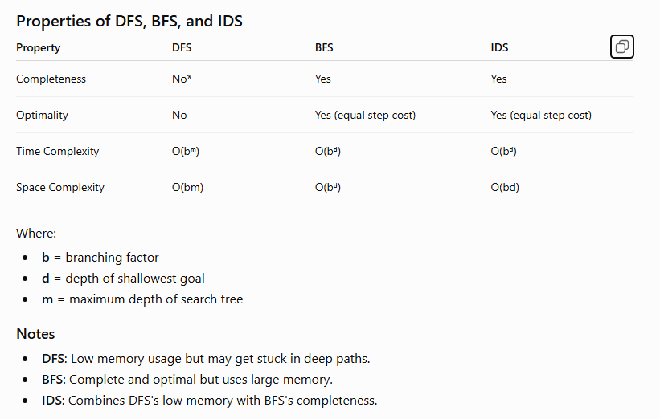

## 4.3. Question 3:
Briefly explain the main idea behind IDS & DLS search algorithms

### 4.3.1. Answer:
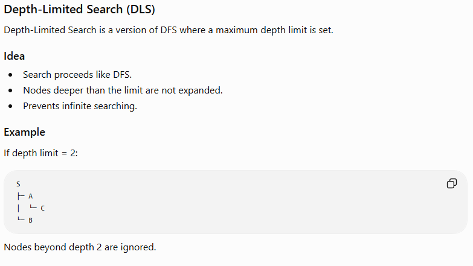
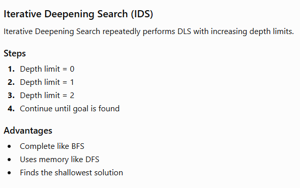


# 5. CT1 SET A:
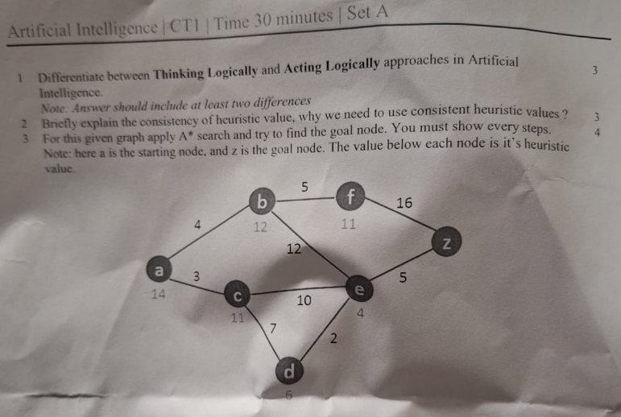
## 5.1. Ans to the Question No. 1: 
| Thinking Logically                                                                 | Acting Logically                                                           |
| ---------------------------------------------------------------------------------- | -------------------------------------------------------------------------- |
| Focuses on correct reasoning and drawing logical conclusions.                      | Focuses on taking actions that achieve goals successfully.                 |
| Uses formal logic and inference rules.                                             | Uses rational behavior and decision making.                                |
| An action may not be taken even if it is useful unless it can be logically proven. | May act with incomplete information if it increases the chance of success. |
| Example: Proving a mathematical theorem.                                           | Example: A self-driving car choosing the safest route.                     |

**Two Key Differences:**
- Thinking logically emphasizes correct reasoning, while acting logically emphasizes achieving goals.
- Thinking logically relies on formal logic, while acting logically relies on rational actions and outcomes.

## 5.2. Ans to the Question No. 2:
A heuristic is consistent (monotonic) if:
```
h(n)≤c(n,n′)+h(n′)
```

where,
- h(n) = heuristic value of current node
- c(n,n′) = cost from node n to successor n′
- h(n′) = heuristic value of successor node

**Why consistency is important:**
- Guarantees Optimal Solution
- Avoids Re-expanding Nodes
- Improves Efficiency
- Ensures Non-decreasing f-values

## 5.3. Ans to the Question No. 3:
Formula: `f(n)=g(n)+h(n)`

where,
- g(n) = cost from start node to current node
- h(n) = heuristic value
- f(n) = total estimated cost

**Step 1: Start from a:**

```
g(a)=0, h(a)=14
f(a)=0+14=14
```
Expand a.

**Step 2: Check neighbors of a:**

```
b
g=4, h=12
f=4+12=16
```

```
c
g=3, h=11
f=3+11=14
```
Choose c because it has the smallest f-value.

**Step 3: Check neighbors of c:**
```
d
g=3+7=10
f=10+6=16
```
```
e
g=3+10=13
f=13+4=17
```

Current candidates:
| Node | f   |
| ---- | --- |
| b    | 16  |
| d    | 16  |
| e    | 17  |

Choose d (or b if your teacher expands ties differently).

**Step 4: Check neighbor of d:**

New cost:
```
e
g=10+2=12
f=12+4=16
```

This is better than previous f=17, so update e.

Current candidates:
| Node | f   |
| ---- | --- |
| b    | 16  |
| e    | 16  |

Choose e.

**Step 5: Check neighbor of e:**

```
z
g=12+5=17
f=17+0=17
```

Goal node found

**Optimal Path:**


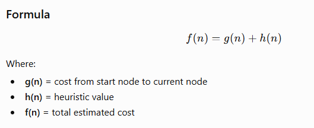
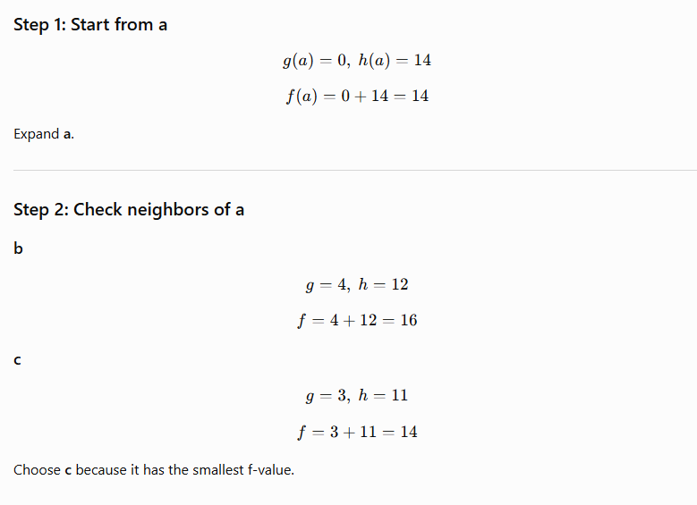
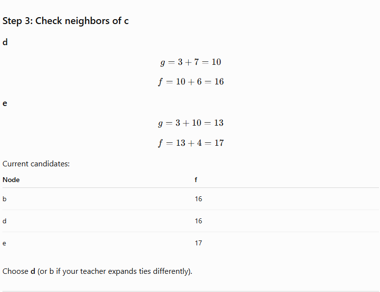
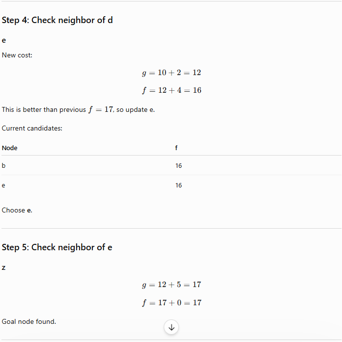
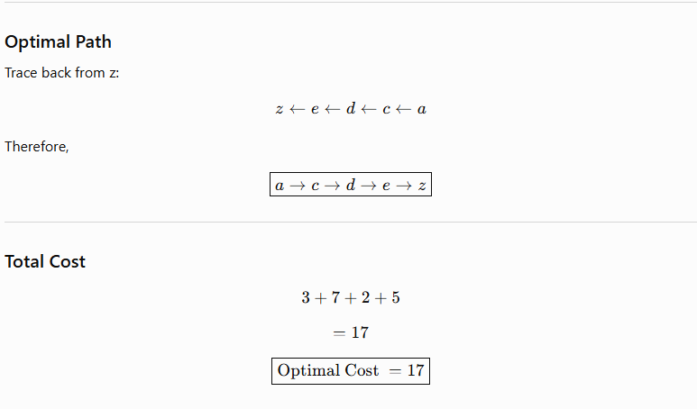

# 6. CT1 SET B: 


