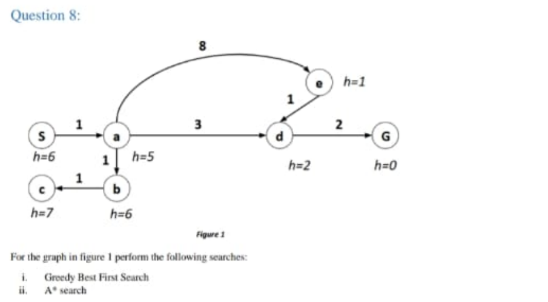
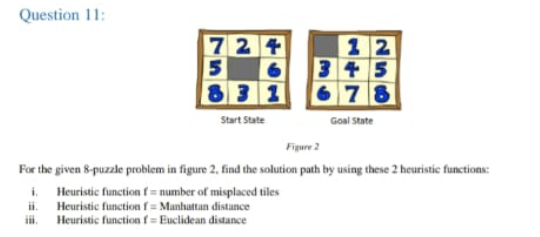
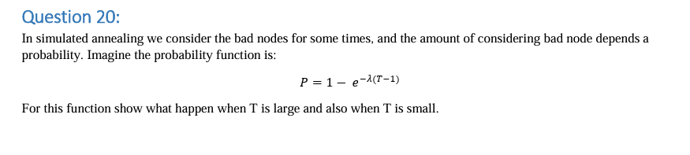
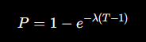
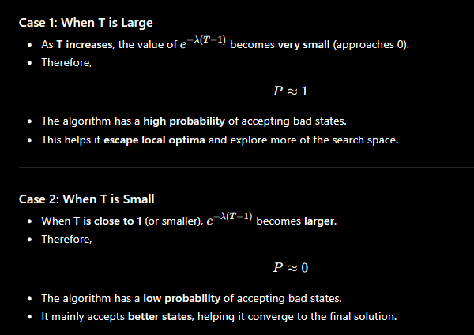
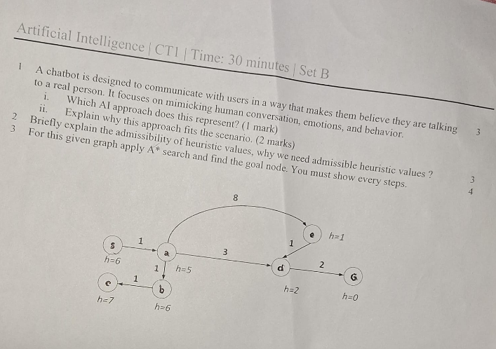

<h1 align="center">CSE0613311 - Artificial Intelligence</h1>

- [1. Introduction to Artificial Intelligence:](#1-introduction-to-artificial-intelligence)
  - [1.1. What is AI:](#11-what-is-ai)
  - [1.2. Main Goals of AI:](#12-main-goals-of-ai)
  - [1.3. Why AI:](#13-why-ai)
  - [1.4. Foundation of AI:](#14-foundation-of-ai)
  - [1.5. A Short History of AI:](#15-a-short-history-of-ai)
  - [1.6. What Can AI Do:](#16-what-can-ai-do)
  - [1.7. What Can’t AI Systems Do Yet:](#17-what-cant-ai-systems-do-yet)
  - [1.8. Big Questions:](#18-big-questions)
  - [1.9. Who Does AI:](#19-who-does-ai)
  - [1.10. Four Goals of AI:](#110-four-goals-of-ai)
  - [1.11. What is Turing Test \& Loebner Test:](#111-what-is-turing-test--loebner-test)
  - [1.12. Purpose of Turing Test \& Loebner Test:](#112-purpose-of-turing-test--loebner-test)
  - [1.13. How Turing Test \& Loebner Test Work:](#113-how-turing-test--loebner-test-work)
  - [1.14. What is Heuristic System:](#114-what-is-heuristic-system)
  - [1.15. Reasoning Areas Where AI is Used:](#115-reasoning-areas-where-ai-is-used)
  - [1.16. Strong AI vs Weak AI:](#116-strong-ai-vs-weak-ai)
- [2. Agent and Environment:](#2-agent-and-environment)
  - [2.1. What is Agent:](#21-what-is-agent)
  - [2.2. Rationality and Autonomy:](#22-rationality-and-autonomy)
    - [2.2.1. Rationality:](#221-rationality)
    - [2.2.2. Autonomy:](#222-autonomy)
  - [2.3. Types of Agents:](#23-types-of-agents)
    - [2.3.1. Simple Reflex Agent:](#231-simple-reflex-agent)
    - [2.3.2. Model-Based Reflex Agent:](#232-model-based-reflex-agent)
    - [2.3.3. Goal-Based Agent:](#233-goal-based-agent)
    - [2.3.4. Utility-Based Agent:](#234-utility-based-agent)
    - [2.3.5. Learning Agent:](#235-learning-agent)
  - [2.4. Properties of Environments:](#24-properties-of-environments)
- [3. Searching Algorithms:](#3-searching-algorithms)
  - [3.1. Uninformed Search:](#31-uninformed-search)
    - [3.1.1. Uninformed Search Algorithms:](#311-uninformed-search-algorithms)
      - [3.1.1.1. Breadth-First Search (BFS):](#3111-breadth-first-search-bfs)
      - [3.1.1.2. Depth-First Search (DFS):](#3112-depth-first-search-dfs)
      - [3.1.1.3. Uniform Cost Search (UCS):](#3113-uniform-cost-search-ucs)
      - [3.1.1.4. Depth-Limited Search (DLS):](#3114-depth-limited-search-dls)
      - [3.1.1.5. Iterative Deepening Search (IDS)](#3115-iterative-deepening-search-ids)
      - [3.1.1.6. Quick Recap:](#3116-quick-recap)
  - [3.2. Informed Search:](#32-informed-search)
    - [3.2.1. Informed Search Algorithms:](#321-informed-search-algorithms)
    - [3.2.2. Informed Search Algorithms:](#322-informed-search-algorithms)
      - [3.2.2.1. Greedy Best-First Search:](#3221-greedy-best-first-search)
      - [3.2.2.2. A\* (A-Star) Search:](#3222-a-a-star-search)
      - [3.2.2.3. Quick Recap:](#3223-quick-recap)
  - [3.3. Local Search:](#33-local-search)
    - [3.3.1. Local Search Algorithms:](#331-local-search-algorithms)
      - [3.3.1.1. Hill Climbing:](#3311-hill-climbing)
  - [3.4. Difference Between Uninformed, Informed, and Local Search:](#34-difference-between-uninformed-informed-and-local-search)
- [4. Home Work 1:](#4-home-work-1)
  - [4.1. Question 1:](#41-question-1)
    - [4.1.1. Answer:](#411-answer)
  - [4.2. Question 2:](#42-question-2)
    - [4.2.1. Answer:](#421-answer)
  - [4.3. Question 3:](#43-question-3)
    - [4.3.1. Answer:](#431-answer)
  - [4.4. Question 4:](#44-question-4)
    - [4.4.1. Answer:](#441-answer)
  - [4.5. Question 5:](#45-question-5)
    - [4.5.1. Answer:](#451-answer)
  - [4.6. Question 6:](#46-question-6)
    - [4.6.1. Answer:](#461-answer)
  - [4.7. Question 7:](#47-question-7)
    - [4.7.1. Answer:](#471-answer)
  - [4.8. Question 8:](#48-question-8)
    - [4.8.1. Answer:](#481-answer)
      - [4.8.1.1. (i) Greedy Best-First Search:](#4811-i-greedy-best-first-search)
      - [4.8.1.2. (ii) A\* Search:](#4812-ii-a-search)
  - [4.9. Question 9:](#49-question-9)
    - [4.9.1. Anser:](#491-anser)
      - [4.9.1.1. Consistency:](#4911-consistency)
      - [4.9.1.2. Admissibility:](#4912-admissibility)
      - [4.9.1.3. Why should heuristic values be Consistent and Admissible?](#4913-why-should-heuristic-values-be-consistent-and-admissible)
  - [4.10. Question 10:](#410-question-10)
    - [4.10.1. Answer:](#4101-answer)
  - [4.11. Question 11:](#411-question-11)
    - [4.11.1. Answer:](#4111-answer)
      - [4.11.1.1. (i) Heuristic: Number of Misplaced Tiles:](#41111-i-heuristic-number-of-misplaced-tiles)
      - [4.11.1.2. (ii) Heuristic: Manhattan Distance:](#41112-ii-heuristic-manhattan-distance)
      - [4.11.1.3. (iii) Heuristic: Euclidean Distance:](#41113-iii-heuristic-euclidean-distance)
  - [4.12. Question 12:](#412-question-12)
    - [4.12.1. Answer:](#4121-answer)
  - [4.13. Question 13:](#413-question-13)
    - [4.13.1. Answer:](#4131-answer)
  - [4.14. Question 14:](#414-question-14)
    - [4.14.1. Answer:](#4141-answer)
  - [4.15. Question 15:](#415-question-15)
    - [4.15.1. Answer:](#4151-answer)
  - [4.16. Question 16:](#416-question-16)
    - [4.16.1. Answer:](#4161-answer)
  - [4.17. Question 17:](#417-question-17)
    - [4.17.1. Answer:](#4171-answer)
  - [4.18. Question 18:](#418-question-18)
    - [4.18.1. Answer:](#4181-answer)
  - [4.19. Question 19:](#419-question-19)
    - [4.19.1. Answer:](#4191-answer)
  - [4.20. Question 20:](#420-question-20)
    - [4.20.1. Answer:](#4201-answer)
- [5. CT1 SET A:](#5-ct1-set-a)
  - [5.1. Ans to the Question No. 1:](#51-ans-to-the-question-no-1)
  - [5.2. Ans to the Question No. 2:](#52-ans-to-the-question-no-2)
  - [5.3. Ans to the Question No. 3:](#53-ans-to-the-question-no-3)
- [6. CT1 SET B:](#6-ct1-set-b)
  - [6.1. Ans to the Question 1:](#61-ans-to-the-question-1)
  - [6.2. Ans to the Question 2:](#62-ans-to-the-question-2)
  - [6.3. Ans to the Question 3:](#63-ans-to-the-question-3)

# 1. Introduction to Artificial Intelligence:

## 1.1. What is AI:
Artificial Intelligence (AI) is a branch of computer science that creates systems that capable of learning, reasoning, problem-solving, and making decisions in ways that normally require human intelligence.


## 1.2. Main Goals of AI: 

- Learning
- Reasoning
- Problem-Solving
- Perception
- Natural Language Understanding
- Decision-Making
- Automation
- Creating Intelligent Agents

## 1.3. Why AI:
- Automation: Automates repetitive and time-consuming tasks.
- Efficiency: Performs tasks faster and more efficiently than humans.
- Accuracy: Reduces human errors and improves consistency.
- Data Analysis: Processes and analyzes large amounts of data to find useful insights.
- Decision-Making: Helps humans make better decisions by providing intelligent recommendations.

## 1.4. Foundation of AI:
- Computer Science & Engineering
- Mathematics
- Psychology & Cognitive Science
- Philosophy
- Biology
- Neuroscience
- Linguistics
- economics


## 1.5. A Short History of AI:
| Year          | Milestone                           |
| ------------- | ----------------------------------- |
| 1943          | First artificial neuron model       |
| 1950          | Turing Test proposed                |
| 1956          | Birth of AI at Dartmouth Conference |
| 1970s–1980s   | Expert Systems                      |
| 1988–1993     | AI Winter                           |
| 1990s         | Statistical AI                      |
| 2010s–Present | Deep Learning & Generative AI       |


## 1.6. What Can AI Do:
- Learn from data
- Solve problems
- Understand language
- Recognize images and speech
- Make decisions
- Automate tasks
- Make predictions


## 1.7. What Can’t AI Systems Do Yet:

- Truly understand like humans.
- Possess consciousness or self-awareness.
- Think and reason like humans in every situation.
- Make perfect decisions.
- Fully replace humans.


## 1.8. Big Questions: 


| Question                           | Simple Answer                                                                                                      |
| ---------------------------------- | ------------------------------------------------------------------------------------------------------------------ |
| Can machines think?                | AI researchers debate this; machines can perform intelligent tasks, but whether they truly think is controversial. |
| If so, how?                        | By processing information, learning from data, and making decisions using algorithms.                              |
| If not, why not?                   | Because they lack consciousness, emotions, and true understanding.                                                 |
| What does this say about humans?   | It helps us understand what makes human intelligence unique.                                                       |
| What does this say about the mind? | It raises questions about whether the mind works like a computer and whether consciousness can be replicated.      |


## 1.9. Who Does AI:

- AI researchers / scientists: Design new AI theories, algorithms, and models to improve intelligence systems.
- Software engineers: Build and implement AI applications and turn research ideas into real-world software.
- Data scientists: Collect, clean, and analyze data to train AI models and improve their accuracy.
- Technology companies: Develop, deploy, and scale AI products for real users (apps, services, tools).
- Universities and research labs: Conduct academic research, discover new AI methods, and train future experts.

## 1.10. Four Goals of AI:
- Learning: Enable machines to learn from data and improve performance over time.
- Reasoning: Allow machines to make logical decisions based on available information.
- Problem Solving: Help machines find solutions to complex or real-world problems.
- Perception: Enable machines to understand and interpret input from the environment (images, sound, text).


## 1.11. What is Turing Test & Loebner Test: 

- Turing Test: The Turing Test was proposed by Alan Turing. It is a test to check whether a machine can show human-like intelligence in conversation.
- Loebner Test: The Loebner Test (Loebner Prize Competition) is a real-world version of the Turing Test. Means it is an annual competition where judges interact with both humans and AI chat systems.

## 1.12. Purpose of Turing Test & Loebner Test:

- Turing Test: To evaluate whether a machine can imitate human intelligence well enough to be indistinguishable from a human in conversation.
- Loebner Test: To measure how closely AI can simulate human conversation in practice.

## 1.13. How Turing Test & Loebner Test Work:
- Turing Test: A human judge chats with two hidden participants: one human and one machine (AI). If the judge cannot reliably tell which one is the machine, the AI is said to pass the test.
- Loebner Test: Judges have conversations and try to identify which participant is the machine. The AI that most closely mimics human conversation performs best.


## 1.14. What is Heuristic System: 
A heuristic system is an AI approach that solves problems using experience-based rules or “rules of thumb” instead of trying every possible solution. For example: 
- In chess AI, instead of analyzing every possible move, the system uses heuristics to choose strong moves quickly.
- In GPS navigation, it quickly finds a good route instead of checking all possible routes.

## 1.15. Reasoning Areas Where AI is Used: 
- Medical diagnosis (finding diseases)
- Expert systems (decision support in law, finance, medicine)
- Game playing (chess, strategy games)
- Planning & scheduling (delivery routes, logistics)
- Natural language reasoning (chatbots, Q&A systems)

## 1.16. Strong AI vs Weak AI: 
| Feature       | Weak AI               | Strong AI                              |
| ------------- | --------------------- | -------------------------------------- |
| Scope         | Limited tasks         | Any task like humans                   |
| Intelligence  | Narrow                | General                                |
| Understanding | No real understanding | Human-like understanding (theoretical) |
| Existence     | Exists today          | Not yet built                          |

# 2. Agent and Environment:
## 2.1. What is Agent: 
An agent is anything that can perceive its environment through sensors and act upon that environment through actuators to achieve a goal. For examples:
- Human: Eyes and ears (sensors), hands and legs (actuators).
- Robot: Cameras and sensors (sensors), motors and wheels (actuators).
- AI Software: Input data (sensors), generated outputs or actions (actuators).

## 2.2. Rationality and Autonomy:
### 2.2.1. Rationality: 
A rational agent chooses the action that is expected to achieve the best outcome based on its knowledge and goals. For example: 
- A GPS navigation system selects the shortest or fastest route to a destination.

### 2.2.2. Autonomy: 
Autonomy is the ability of an agent to operate independently without constant human intervention. For example: 
- A self-driving car can make driving decisions on its own.

Note: There are two Levels of Autonomy:
1. Low autonomy: Requires frequent human control.
2. High autonomy: Makes most decisions independently.

## 2.3. Types of Agents:
1. Simple Reflex Agent: 
2. Model-Based Reflex Agent
3. Goal-Based Agent
4. Utility-Based Agent
5. Learning Agent

### 2.3.1. Simple Reflex Agent:
Acts only on the current percept using condition-action rules.

Example: 
- If room is dirty → Vacuum.
- If room is clean → Do nothing.

Characteristics:
- No memory
- No knowledge of past states

### 2.3.2. Model-Based Reflex Agent:
Maintains an internal model (memory) of the environment.

Example:
- A robot remembers which rooms it has already cleaned.

Characteristics:
- Uses current percept + internal state
- Better than simple reflex agents

### 2.3.3. Goal-Based Agent:
Chooses actions based on achieving specific goals.

Example:
- A navigation system finding a route to a destination.

Characteristics:
- Considers future outcomes
- Uses search and planning

### 2.3.4. Utility-Based Agent:
Chooses actions that maximize a utility (preference) measure.

Example:
- A ride-sharing app choosing the fastest and cheapest route.

Characteristics:
- Evaluates multiple possible outcomes
- Selects the most beneficial one

### 2.3.5. Learning Agent:
Improves performance through experience.

Example:
- A spam filter that becomes better at detecting spam emails over time.

Characteristics:
- Learns from data and feedback
- Adapts to new situations

## 2.4. Properties of Environments: 
The environment in which an agent operates can be described using several properties such as: 
1. Fully Observable vs Partially Observable:
   - Fully observable: Agent can perceive the complete state of the environment. For example: chess game.
   - Partially observable: Agent cannot see the entire environment.. For example: poker game.
2. Deterministic vs Stochastic:
   - Deterministic: Actions always produce predictable results. For example: Solving a math problem
   - Stochastic: Actions may have uncertain outcomes. For example: Weather forecasting
3. Episodic vs Sequential:
   - Episodic: Each decision is independent. For example: Image classification.
   - Sequential: Current decisions affect future decisions. For example: Chess. 
4. Static vs Dynamic:
   - Static: Environment does not change while the agent is making decisions. For example: Crossword puzzle.
   - Dynamic: Environment can change during decision-making. For example: Driving a car.
5. Discrete vs Continuous:
   - Discrete: Finite number of states and actions. For example: Chess.
   - Continuous: Infinite range of states or actions. For example: Autonomous driving.
6. Single-Agent vs Multi-Agent:
   - Single-Agent: Only one agent operates in the environment. For example: Sudoku solver.
   - Multi-Agent: Multiple agents interact with each other. For example: Football game.


# 3. Searching Algorithms:
In Artificial Intelligence, search algorithms are often divided into two categories:
1. Uninformed Search
2. Informed Search 
   
## 3.1. Uninformed Search:
Uninformed search algorithms have no extra information about how close a state is to the goal. They only know:
- The initial state
- The possible actions
- The goal test

**Characteristics:**
- No heuristic knowledge is used.
- Searches blindly through possible states.
- Usually explores more nodes.
- Can be slower for large problems.

**Example:**
Imagine finding a treasure in a maze(গোলকধাঁধা) without any clues. You keep checking paths until you find it.

```
Start
  |
 / \
A   B
|   |
C   Goal
```

### 3.1.1. Uninformed Search Algorithms:
#### 3.1.1.1. Breadth-First Search (BFS):
BFS explores nodes level by level. It visits all nodes at the current depth before moving to the next depth.

**How it Works:**
```
      A
    /   \
   B     C
  / \   / \
 D   E F   G
```
**Traversal order:** `A → B → C → D → E → F → G`

**Data Structure:** Queue (FIFO: First In, First Out)

**Steps:** 
- Start at the root node.
- Visit the node.
- Add its children to the queue.
- Remove the first node from the queue and repeat.

**Advantages:**
- Complete (finds a solution if one exists).
- Finds the shortest path when all costs are equal.

**Disadvantages:**
- Uses a lot of memory.
- Slow for deep trees.

**Time & Space Complexity:**
| Time Complexity | Space Complexity |
| --------------- | ---------------- |
| O(bᵈ)           | O(bᵈ)            |

where,
- b = branching factor
- d = depth of shallowest goal

#### 3.1.1.2. Depth-First Search (DFS):
DFS explores one branch as deep as possible before backtracking.

**How it Works:**
```
      A
    /   \
   B     C
  / \   / \
 D   E F   G
```
**Traversal order:** `A → B → D → E → C → F → G`

**Data Structure:** Stack (LIFO: Last In, First Out) Or recursion

**Steps:** 
- Visit a node.
- Go to its first child.
- Continue deeper until no child exists.
- Backtrack and explore remaining branches.

**Advantages:**
- Requires less memory.
- Easy to implement.

**Disadvantages:**
- May get stuck in deep or infinite paths.
- Does not guarantee the shortest path.

**Time & Space Complexity:**
| Time Complexity | Space Complexity |
| --------------- | ---------------- |
| O(bᵐ)           | O(bm)            |

where,
- m = maximum depth

#### 3.1.1.3. Uniform Cost Search (UCS):
UCS expands the node with the lowest path cost first. Unlike BFS, UCS considers edge costs.

**How it Works:**
```
      A
    /   \
   B(2) C(1)
    |     |
 Goal(3) Goal(10)
```

**Possible paths:**
```
A → B → Goal = 5
A → C → Goal = 11
```

**UCS chooses:**
```
A → B → Goal
```
because cost 5 is lower.

**Data Structure:** Priority Queue (Min Heap)

**Steps:** 
- Start at the root node.
- Visit the lowest-cost node.
- Add its children with their costs.
- Choose the lowest-cost node again.
- Repeat until the goal is found.

**Advantages:**
- Complete.
- Finds the optimal (lowest-cost) solution.

**Disadvantages:**
- Can use large memory.
- May explore many nodes.

**Time & Space Complexity:**
| Time Complexity                           | Space Complexity               |
| ----------------------------------------- | ------------------------------ |
| Depends on path costs; often exponential. | Exponential in the worst case. |

#### 3.1.1.4. Depth-Limited Search (DLS):
DLS is a DFS variant that searches only up to a specified depth limit.

**How it Works:**
```
        A
      /   \
     B     C
    / \
   D   E
  /
 F
```

Depth Limit = 2

**Traversal order:** `A → B → D → E → C`
Note: (F is not visited because it is beyond the depth limit.)

**Data Structure:** Stack (LIFO) or recursion

**Steps:** 
- Start at the root node.
- Visit the node.
- Go deeper to its children.
- Stop when the depth limit is reached.
- Backtrack and explore other branches.

**Advantages:**
- Uses less memory than BFS.
- Prevents searching infinitely deep paths.

**Disadvantages:**
- May miss the goal if it is beyond the depth limit.
- Does not guarantee the shortest path.

**Time & Space Complexity:**
| Time Complexity | Space Complexity |
| --------------- | ---------------- |
| O(bˡ)           | O(bl)            |

where,
- b = branching factor
- l (mama it's not 1, its L means limit) = depth limit

#### 3.1.1.5. Iterative Deepening Search (IDS)
IDS combines DFS and BFS. It repeatedly runs DLS with increasing depth limits until the goal is found.

**How it Works:**
```
        A
      /   \
     B     C
    / \   / \
   D   E F   G
```
**Traversal order:**
- Depth Limit = 0: `A`
- Depth Limit = 1: `A → B → C`
- Depth Limit = 2: `A → B → D → E → C → F → G`

The search continues with larger depth limits until the goal is found.


**Data Structure:** Stack (LIFO) or recursion

**Steps:** 
- Start with depth limit 0.
- Perform DLS.
- If the goal is not found, increase the depth limit.
- Run DLS again.
- Repeat until the goal is found.

**Advantages:**
- Complete.
- Finds the shortest path when all costs are equal.
- Uses less memory than BFS.

**Disadvantages:**
- Repeats searching the same nodes multiple times.
- Can be slower than BFS.

**Time & Space Complexity:**
| Time Complexity | Space Complexity |
| --------------- | ---------------- |
| O(bᵈ)           | O(bd)            |

where,
- b = branching factor
- d = depth of shallowest goal

#### 3.1.1.6. Quick Recap: 
| Algorithm | Strategy                                  | Data Structure           | Complete?                    | Optimal?                     |
| --------- | ----------------------------------------- | ------------------------ | ---------------------------- | ---------------------------- |
| BFS       | Explore level by level                    | Queue (FIFO)             | Yes                          | Yes (if all costs are equal) |
| DFS       | Go as deep as possible                    | Stack (LIFO) / Recursion | No (for infinite depth)      | No                           |
| UCS       | Choose the lowest-cost path               | Priority Queue           | Yes                          | Yes                          |
| DLS       | DFS with a depth limit                    | Stack (LIFO) / Recursion | No (if goal is beyond limit) | No                           |
| IDS       | Repeatedly run DLS with increasing limits | Stack (LIFO) / Recursion | Yes                          | Yes (if all costs are equal) |

## 3.2. Informed Search: 
Informed search algorithms use additional knowledge (heuristics) to estimate how close a state is to the goal.
  - A heuristic is a rule or estimate that helps decide which path looks more promising.

**Characteristics:**
- Uses heuristic information.
- Searches more intelligently.
- Usually explores fewer nodes.
- Often faster than uninformed search.

**Example:**
Imagine finding a treasure in a maze while having a map that shows which direction is closer to the treasure. 

```
Start → A → B → Goal (Most close direction to goal)
Start → A → B → C → D → E → Goal
Start → A → B → C → D → E → F → G → H → I → J → Goal
```

### 3.2.1. Informed Search Algorithms:

### 3.2.2. Informed Search Algorithms:

#### 3.2.2.1. Greedy Best-First Search:

Greedy Best-First Search chooses the node that appears closest to the goal according to a heuristic value.

**Heuristic Function:**

```
h(n) = Estimated cost from node n to the goal
```

**How it Works:**

```
        A
      /   \
   B(4)   C(2)
   /         \
Goal(1)    Goal(5)
```

The numbers represent heuristic values h(n).

**Greedy chooses:**

```
A → C
```

because `h(C) = 2` is smaller than `h(B) = 4`.

**Data Structure:** Priority Queue (ordered by heuristic value h(n))

**Steps:**

* Start at the root node.
* Check the heuristic value of each child.
* Choose the node that seems closest to the goal.
* Visit that node.
* Repeat until the goal is found.

**Advantages:**

* Often faster than uninformed search.
* Usually explores fewer nodes.

**Disadvantages:**

* Not guaranteed to find the shortest path.
* Can be misled by a poor heuristic.

**Time & Space Complexity:**

| Time Complexity | Space Complexity |
| --------------- | ---------------- |
| O(bᵐ)           | O(bᵐ)            |

where,

* b = branching factor
* m = maximum depth

---

#### 3.2.2.2. A* (A-Star) Search:

A* Search combines the actual path cost and the heuristic estimate to find the best path.

**Evaluation Function:**

```
f(n) = g(n) + h(n)
```

where,

* g(n) = actual cost from the start node to n
* h(n) = estimated cost from n to the goal
* f(n) = total estimated cost

**How it Works:**

```
        A
      /   \
   B       C
 g=2     g=1
 h=3     h=10
```

**Calculate f(n):**

```
f(B) = 2 + 3 = 5
f(C) = 1 + 10 = 11
```

**A* chooses:**

```
A → B
```

because `f(B) = 5` is smaller than `f(C) = 11`.

**Data Structure:** Priority Queue (ordered by f(n))

**Steps:**

* Start at the root node.
* Calculate f(n) = g(n) + h(n).
* Choose the node with the lowest f(n).
* Visit that node.
* Update costs for its children.
* Repeat until the goal is found.

**Advantages:**

* Complete.
* Finds the optimal path when the heuristic is admissible.
* Usually explores fewer nodes than UCS.

**Disadvantages:**

* Uses a lot of memory.
* Performance depends on the quality of the heuristic.

**Time & Space Complexity:**

| Time Complexity               | Space Complexity              |
| ----------------------------- | ----------------------------- |
| Exponential in the worst case | Exponential in the worst case |

#### 3.2.2.3. Quick Recap:
| Algorithm                | Strategy                                     | Uses Heuristic?   | Complete? | Optimal?                        |
| ------------------------ | -------------------------------------------- | ----------------- | --------- | ------------------------------- |
| Greedy Best-First Search | Choose node that appears closest to the goal | Yes (h(n))        | No        | No                              |
| A* Search                | Choose node with lowest total estimated cost | Yes (g(n) + h(n)) | Yes       | Yes (with admissible heuristic) |


## 3.3. Local Search:

Local search algorithms focus on finding a good solution by moving from one state to a neighboring state. Unlike other search algorithms, they usually do not keep track of the full path from the start state to the goal state.

**Characteristics:**
- Uses only the current state and its neighbors.
- Requires very little memory.
- Often used for optimization problems.
- Does not usually guarantee the optimal solution.
- Can get stuck in local optima.

**Example:**
Imagine trying to reach the highest point on a mountain while standing somewhere on it. At each step, you move to the highest neighboring point until no higher neighbor exists.

```
      10
     /  \
   15    20
         / \
       25  18
```

Traversal:

```
10 → 20 → 25
```

The algorithm stops at 25 because there is no higher neighboring state.

### 3.3.1. Local Search Algorithms:

#### 3.3.1.1. Hill Climbing:

Hill Climbing repeatedly moves to the neighboring state with the best value.

**How it Works:**

```
      5
     / \
    8   7
   /
 10
```

**Traversal:**

```
5 → 8 → 10
```

The algorithm always chooses the best neighboring state.

**Steps:**
- Start with an initial state.
- Evaluate neighboring states.
- Move to the best neighbor.
- Repeat until no better neighbor exists.

**Advantages:**
- Simple to implement.
- Uses very little memory.
- Often finds a good solution quickly.

**Disadvantages:**
- Can get stuck in local optima.
- Can get stuck on plateaus.
- Does not guarantee the optimal solution.

**Time & Space Complexity:**

| Time Complexity | Space Complexity |
| --------------- | ---------------- |
| O(∞) Worst Case | O(1)             |

---


## 3.4. Difference Between Uninformed, Informed, and Local Search:

| Feature        | Uninformed Search   | Informed Search          | Local Search                                          |
| -------------- | ------------------- | ------------------------ | ----------------------------------------------------- |
| Knowledge Used | No extra knowledge  | Uses heuristic knowledge | Uses current state and neighbors                      |
| Search Style   | Blind search        | Guided search            | Optimization search                                   |
| Path Tracking  | Yes                 | Yes                      | Usually No                                            |
| Memory Usage   | Medium to High      | Medium to High           | Low                                                   |
| Speed          | Usually slower      | Usually faster           | Often very fast                                       |
| Goal           | Find a path to goal | Find a path efficiently  | Find a good/optimal state                             |
| Examples       | BFS, DFS, UCS       | Greedy Search, A*        | Hill Climbing, Simulated Annealing, Genetic Algorithm |

# 4. Home Work 1:
## 4.1. Question 1: 
 


**Note:** Mama if you look closely to the graph you will see a pattern like this: 

```
START → A (2)
START → B (3)
START → D (5)
A → C (4)
B → D (4)
C → D (1)
C → G (2)
D → G (5)
```

and here our goal is to try to resolve the graph in such a way that states with earlier alphabetical order and expanded first.

### 4.1.1. Answer:

- Depth-First Search:  


- Breadth-First Search:


- Uniform Cost Search:


## 4.2. Question 2: 


### 4.2.1. Answer:


## 4.3. Question 3:
Briefly explain the main idea behind IDS & DLS search algorithms

### 4.3.1. Answer:


## 4.4. Question 4: 
In Interactive Depending search & Depth limited search we visit upper position of the graph tree multiple time. It increase the time complexity, still how it is better than BFS & DFS? 

### 4.4.1. Answer: 

Although IDS and DLS visit some upper-level nodes multiple times, but they are still better than BFS and DFS in many cases:
- IDS uses less memory than BFS.
- IDS can still find the shallowest (optimal) solution, like BFS (when all step costs are equal).
- DLS prevents searching too deep, so it avoids the infinite-depth problem of DFS.
- The repeated node visits are few, so the extra time is usually acceptable.

So IDS and DLS are better because they use less memory, avoid unnecessary deep searches, and IDS can still find the shallowest solution.

## 4.5. Question 5: 
Imagine a scenario where you are search in a graph like google map, but it is more advance, hundreds of nodes can be added instantly. Its gives you a fell that the tree has an infinite depth. In that case to search in the graph for a goal node which one you will choose among BFS & DFS. Justify your answer with proper reasoning.

### 4.5.1. Answer: 
I would choose BFS (Breadth-First Search). Because of:
- In a graph that feels like it has infinite depth, DFS may keep exploring one path forever and may never reach the goal.
- BFS explores the graph level by level, so if the goal exists at a finite depth, BFS is guaranteed to find it.
- Although BFS uses more memory, it is more reliable for finding a solution in an infinite-depth graph.

so i Choose BFS because it searches level by level and is guaranteed to find the goal (if one exists), whereas DFS may get stuck exploring an infinite path and never find the goal.

## 4.6. Question 6:
Imagine a scenario where you are searching in a very depth graph, depth size around 5 million, and you know that the goal node is not the shallow depth. Goal node belongs to the very depth for example 3.8 million depth your goal is present. In that case to search in the graph for a goal node, which one you will choose among BFS & DFS. Justify your answer with proper reasoning. 

### 4.6.1. Answer: 
I would choose DFS (Depth-First Search) because: 
- The goal node is very deep (around 3.8 million levels).
- BFS would have to store all nodes at every level before reaching the goal, which requires a huge amount of memory.
- DFS goes deep into the graph quickly and uses much less memory.
- Since we already know the goal is at a very deep level, DFS is the better choice.

So Choose DFS because the goal is very deep, and DFS reaches deep nodes faster while using much less memory than BFS.

## 4.7. Question 7: 
What you understand by the term "Heuristic". provide an example of heuristic. 

### 4.7.1. Answer:
A heuristic is a rule of thumb or an estimate that helps a search algorithm decide which path is more likely to reach the goal faster. It does not always guarantee the best solution, but it usually finds a good solution more efficiently.

Example: In Google Maps, the straight-line distance from your current location to your destination is used as a heuristic. The algorithm uses this estimate to choose roads that are likely to reach the destination faster.

## 4.8. Question 8: 



### 4.8.1. Answer:
From the graph:
- Heuristic values:
  - h(S)=6
  - h(a)=5
  - h(b)=6
  - h(c)=7
  - h(d)=2
  - h(e)=1
  - h(G)=0
- Edge costs:
  - S → a = 1
  - a → b = 1
  - b → c = 1
  - a → d = 3
  - a → e = 8
  - e → d = 1
  - d → G = 2

#### 4.8.1.1. (i) Greedy Best-First Search:
Greedy Best-First Search always selects the node with the smallest heuristic value (h).

| Step | Frontier               | Selected Node |
| ---- | ---------------------- | ------------- |
| 1    | S                      | S             |
| 2    | a(h=5)                 | a             |
| 3    | b(h=6), d(h=2), e(h=1) | e             |
| 4    | b(h=6), d(h=2)         | d             |
| 5    | b(h=6), G(h=0)         | G (Goal)      |

Expansion Order: `S → a → e → d → G`
Path Found: `S → a → e → d → G`
Path Cost: `1 + 8 + 1 + 2 = 12`

#### 4.8.1.2. (ii) A* Search:
A* uses the formula `f(n) = g(n) + h(n)` to select nodes.

where, 
- g(n) = path cost from Start
- h(n) = heuristic estimate

| Node | g(n) | h(n) | f(n)=g+h |
| ---- | ---: | ---: | -------: |
| S    |    0 |    6 |        6 |
| a    |    1 |    5 |        6 |
| b    |    2 |    6 |        8 |
| d    |    4 |    2 |        6 |
| e    |    9 |    1 |       10 |
| G    |    6 |    0 |        6 |

Expansion Order: `S → a → d → G`
Optimal Path: `S → a → d → G`
Total Cost: `1 + 3 + 2 = 6`

## 4.9. Question 9: 
Explain the consistency & admissibility of heuristic value. Why the heuristic values need to be consistent & admissible?

### 4.9.1. Anser: 

#### 4.9.1.1. Consistency: 
A heuristic is consistent if the estimated cost from a node to the goal is never greater than the cost of going to a neighboring node plus that neighbor's heuristic.

Formula: `h(n) ≤ c(n, n') + h(n')`
where:
- h(n) = heuristic of current node
- c(n, n') = cost from current node to next node
- h(n') = heuristic of next node

Simple Example:
- h(A) = 5
- Cost A → B = 2
- h(B) = 3

Since:

```
5 ≤ 2 + 3
5 ≤ 5 ✔
```

The heuristic is consistent.

#### 4.9.1.2. Admissibility:
A heuristic is admissible if it never overestimates the actual minimum cost to reach the goal.

Formula: `h(n) ≤ Actual Cost to Goal`

Simple Example: 
Actual cost from A to Goal = 7
- h(A) = 5 ✔ (Admissible)
- h(A) = 7 ✔ (Admissible)
- h(A) = 9 ✘ (Not admissible because it overestimates)

#### 4.9.1.3. Why should heuristic values be Consistent and Admissible?
- Admissibility ensures that algorithms like A* can find the optimal (lowest-cost) path.
- Consistency ensures that the heuristic values are logical and prevents unnecessary re-expansion of nodes, making the search more efficient.

## 4.10. Question 10:
Is it possible to be a heuristic value that is admissible but not consistent? if yes, then provide an example.

### 4.10.1. Answer: 

Yes. A heuristic can be admissible but not consistent. This happens when the heuristic never overestimates the actual cost to the goal (admissible), but violates the consistency condition.

**Example:**
Consider the graph: `A --2--> B --2--> Goal`
Heuristic values: 
```
h(A) = 3
h(B) = 0
h(Goal) = 0
```

Actual costs to the goal:
- From A = 4
- From B = 2

**Check Admissibility:**
- h(A) = 3 ≤ 4 ✔
- h(B) = 0 ≤ 2 ✔

So, the heuristic is admissible.

**Check Consistency:**
Consistency requires: `h(A) ≤ Cost(A,B) + h(B)`
Substitute the values: 
```
3 ≤ 2 + 0
3 ≤ 2 ✘
```

This is false, so the heuristic is not consistent.

## 4.11. Question 11:


### 4.11.1. Answer: 
For this question, they are asking you to calculate the heuristic values for the given start state using three heuristic functions. You do not need to solve the entire puzzle—just compute the heuristic values.

Start State:
```
7 2 4
5 _ 6
8 3 1
```

Goal State:
```
_ 1 2
3 4 5
6 7 8
```

#### 4.11.1.1. (i) Heuristic: Number of Misplaced Tiles:
Count how many tiles are not in their correct position (ignore the blank).

| Tile | Correct Position? |
| ---- | ----------------- |
| 1    | ✘                 |
| 2    | ✘                 |
| 3    | ✘                 |
| 4    | ✘                 |
| 5    | ✘                 |
| 6    | ✘                 |
| 7    | ✘                 |
| 8    | ✔                 |

Misplaced tiles = 7
Answer: `h(n) = 7`

#### 4.11.1.2. (ii) Heuristic: Manhattan Distance:
Manhattan Distance = Horizontal moves + Vertical moves for each tile.
| Tile | Distance |
| ---- | -------: |
| 1    |        3 |
| 2    |        1 |
| 3    |        2 |
| 4    |        2 |
| 5    |        2 |
| 6    |        3 |
| 7    |        3 |
| 8    |        0 |

Total: `3 + 1 + 2 + 2 + 2 + 3 + 3 + 0 = 16`
Answer: `h(n) = 16`

#### 4.11.1.3. (iii) Heuristic: Euclidean Distance:
Euclidean Distance uses the formula: `√((x₂ − x₁)² + (y₂ − y₁)²)`
Calculate the distance for every tile and add them:
| Tile | Distance (Approx.) |
| ---- | -----------------: |
| 1    |               2.24 |
| 2    |               1.00 |
| 3    |               2.00 |
| 4    |               2.00 |
| 5    |               1.41 |
| 6    |               2.24 |
| 7    |               2.24 |
| 8    |               0.00 |

Total: `≈ 13.13`
Answer: `h(n) ≈ 13.13`

## 4.12. Question 12: 
Briefly explain what is ai agent? Also explain every type of ai agent with example.

### 4.12.1. Answer: 
**What is an AI Agent:** An AI agent is a system that perceives its environment through sensors and takes actions through actuators to achieve a goal. 

**Types of AI Agents:**
- Simple Reflex Agent: A thermostat turns on the AC when the temperature becomes too high.
- Model-Based Reflex Agent: A robot vacuum remembers where it has already cleaned.
- Goal-Based Agent: Google Maps finds the best route to reach a destination.
- Utility-Based Agent: A self-driving car chooses the safest and fastest route.
- learning Agent: Netflix or YouTube recommends better content based on your watching history.

## 4.13. Question 13:
Briefly explain every type of environment with an example of agent who is suitable for that environment.

### 4.13.1. Answer:
| Environment Type     | Meaning                          | Example              | Suitable Agent           |
| -------------------- | -------------------------------- | -------------------- | ------------------------ |
| Fully Observable     | Complete information available   | Chess                | Simple Reflex Agent      |
| Partially Observable | Some information is hidden       | Self-driving car     | Model-Based Reflex Agent |
| Deterministic        | Same action gives same result    | Math problem         | Goal-Based Agent         |
| Stochastic           | Outcome is uncertain             | Driving in traffic   | Utility-Based Agent      |
| Episodic             | Each task is independent         | Image classification | Simple Reflex Agent      |
| Sequential           | Current action affects future    | Chess                | Goal-Based Agent         |
| Static               | Environment does not change      | Crossword puzzle     | Goal-Based Agent         |
| Dynamic              | Environment changes over time    | Self-driving car     | Utility-Based Agent      |
| Discrete             | Finite states/actions            | Chess                | Goal-Based Agent         |
| Continuous           | Infinite possible states/actions | Robot arm            | Utility-Based Agent      |
| Single-Agent         | One agent only                   | Sudoku solver        | Goal-Based Agent         |
| Multi-Agent          | Multiple interacting agents      | Football robots      | Utility-Based Agent      |

## 4.14. Question 14:
Briefly explain the term artificial intelligence.\

### 4.14.1. Answer:
Artificial Intelligence (AI) is the branch of computer science that develops machines or computer systems capable of performing tasks that normally require human intelligence, such as learning, reasoning, problem-solving, decision-making, and understanding language.

Example: ChatGPT, self-driving cars, Google Maps, and virtual assistants like Siri and Google Assistant are examples of AI systems.

## 4.15. Question 15:
Briefly explain what is Turing Test. Why we use this test?

### 4.15.1. Answer:
**What is the Turing Test:**

The Turing Test was proposed by Alan Turing in 1950 to determine whether a machine can exhibit human-like intelligence.

In this test, a human judge communicates with both a human and a machine through text without knowing which is which. If the judge cannot reliably distinguish the machine from the human, the machine is said to have passed the Turing Test.

**Why do we use the Turing Test:**
- To check whether a machine can think and behave like a human.
- To evaluate the intelligence of an AI system.
- To measure how well an AI can communicate.

## 4.16. Question 16: 
Briefly explain the 4 goals of AI: 
- Thinking humanly
- Thinking rationally
- Acting humanly
- Acting rationally

### 4.16.1. Answer:
- Thinking Humanly:
  - AI tries to think like a human by imitating human reasoning and learning.
  - It focuses on how humans solve problems and make decisions.
  - Example: An AI system that learns and solves problems like a human student.
- Thinking Rationally:
  - AI tries to think logically and make decisions based on reasoning and facts.
  - It focuses on drawing conclusions and making inferences.
  - Example: A medical diagnosis system that uses logical rules to determine the best treatment.
- Acting Humanly:
  - AI tries to act like a human by mimicking human behavior and interactions.
  - It focuses on communication, emotions, and social interactions.
  - Example: A chatbot that can hold a conversation like a human.
- Acting Rationally:
  - AI tries to act in a way that maximizes the chances of achieving its goals.
  - It focuses on making decisions and taking actions that lead to the best outcomes.
  - Example: A self-driving car that chooses the safest and fastest route to reach its destination.

Summary: 
| Goal of AI              | Meaning                      | Example          |
| ----------------------- | ---------------------------- | ---------------- |
| **Thinking Humanly**    | Thinks like a human          | AI student/tutor |
| **Thinking Rationally** | Thinks logically using rules | Chess program    |
| **Acting Humanly**      | Behaves like a human         | ChatGPT, Siri    |
| **Acting Rationally**   | Chooses the best action      | Self-driving car |

## 4.17. Question 17:
Write a very short AI agents description passage that matches with thinking humanly & acting humanly.

### 4.17.1. Answer: 
AI agents that follow the goals of thinking humanly and acting humanly are designed to think and behave like humans. They learn, reason, solve problems, and communicate naturally so that their actions closely resemble those of a real person.

## 4.18. Question 18:
Solve CT1 Question

### 4.18.1. Answer: 
- https://github.com/tamim-111/ai#5-ct1-set-a
- https://github.com/tamim-111/ai#6-ct1-set-b


## 4.19. Question 19:
Briefly explain local search, why we use local search also briefly explain the following local search algorithms:
- Simple hill climbing
- Stochastic hill climbing
- Steepest-ascent hill climbing
- First-choice hill climbing
- Random-restart hill climbing
- Simulated annealing

### 4.19.1. Answer: 
**What is Local Search?**

Local Search is a search technique that starts from one solution and repeatedly moves to a better neighboring solution until it finds a good or optimal solution.

**Why do we use Local Search?**
To solve optimization problems.
It uses less memory than tree search algorithms.
It is suitable for large search spaces where finding the exact path is not important.

**Local Search Algorithms:**

1. Simple Hill Climbing
   - Checks neighbors one by one.
   - Moves to the first better neighbor found.
   - Stops if no better neighbor exists.
   - Example: Climbing a hill by taking the first upward step.

2. Stochastic Hill Climbing
   - Randomly selects one of the better neighboring states.
   - Helps avoid always following the same path.
   - Example: Randomly choosing one of several uphill paths.

3. Steepest-Ascent Hill Climbing
   - Examines all neighboring states.
   - Chooses the neighbor with the greatest improvement.
   - Example: Choosing the steepest path to climb a hill.

4. First-Choice Hill Climbing
   - Randomly checks neighbors.
   - Moves to the first better neighbor found without checking all neighbors.
   - Faster when there are many neighbors.
   - Example: Taking the first uphill path you find.

5. Random-Restart Hill Climbing
   - Runs hill climbing multiple times from different random starting points.
   - Increases the chance of finding the global optimum.
   - Example: Starting to climb a mountain from different locations.

6. Simulated Annealing
   - Usually moves to a better neighbor.
   - Sometimes accepts a worse neighbor to escape local optima.
   - The chance of accepting worse moves decreases over time.
   - Example: A person may take a small downhill step to reach a higher mountain later.

## 4.20. Question 20: 


### 4.20.1. Answer:
In Simulated Annealing, the probability of accepting a worse (bad) state depends on the temperature (T).

Given the probability function: 




# 5. CT1 SET A:

## 5.1. Ans to the Question No. 1: 
| Thinking Logically                                                                 | Acting Logically                                                           |
| ---------------------------------------------------------------------------------- | -------------------------------------------------------------------------- |
| Focuses on correct reasoning and drawing logical conclusions.                      | Focuses on taking actions that achieve goals successfully.                 |
| Uses formal logic and inference rules.                                             | Uses rational behavior and decision making.                                |
| An action may not be taken even if it is useful unless it can be logically proven. | May act with incomplete information if it increases the chance of success. |
| Example: Proving a mathematical theorem.                                           | Example: A self-driving car choosing the safest route.                     |

**Two Key Differences:**
- Thinking logically emphasizes correct reasoning, while acting logically emphasizes achieving goals.
- Thinking logically relies on formal logic, while acting logically relies on rational actions and outcomes.

## 5.2. Ans to the Question No. 2:
A heuristic is consistent (monotonic) if:
```
h(n)≤c(n,n′)+h(n′)
```

where,
- h(n) = heuristic value of current node
- c(n,n′) = cost from node n to successor n′
- h(n′) = heuristic value of successor node

**Why consistency is important:**
- Guarantees Optimal Solution
- Avoids Re-expanding Nodes
- Improves Efficiency
- Ensures Non-decreasing f-values

## 5.3. Ans to the Question No. 3:
A* Search Formula: `f(n) = g(n) + h(n)`

Selected Nodes: `a → c → d → e → z`

Calculations:
```
c : 3 + 11 = 14
d : 10 + 6 = 16
e : 12 + 4 = 16
z : 17 + 0 = 17
```

Optimal Path: `a → c → d → e → z`
Optimal Cost: `3 + 7 + 2 + 5 = 17`

# 6. CT1 SET B: 


## 6.1. Ans to the Question 1:
A chatbot is designed to communicate with users in a way that makes them believe they are talking to a real person. It focuses on mimicking human conversation, emotions, and behavior.
 
- Which AI approach does this represent?
  - This represents the Acting Humanly Approach of Artificial Intelligence.

- Why does this approach fit this scenario?
  - The chatbot imitates human conversation and behavior.
  - Its goal is to interact naturally with users as if it were a human.
  - Success is measured by how human-like the chatbot appears during interaction.

## 6.2. Ans to the Question 2: 
An admissible heuristic is a heuristic that never overestimates the actual minimum cost required to reach the goal node. We need admissible heuristic values because:
- They guarantee that A* Search finds the optimal (shortest) path.
- They prevent the algorithm from choosing a path that appears cheaper than it actually is.
- They improve the efficiency of the search while maintaining correctness.
- They ensure that the estimated cost to the goal is always realistic and trustworthy.

For Example: If the actual cost from a node to the goal is 10, an admissible heuristic may estimate 8, 9, or 10, but never 11 or more.

## 6.3. Ans to the Question 3: 

A* Formula: `f(n)=g(n)+h(n)`

```
S → A : g=1, f=6

A → D : g=4, f=6

D → G : g=6, f=6
```

Optimal Path: `S → A → D → G`ss
Optimal Cost: `1 + 3 + 2 = 6`


