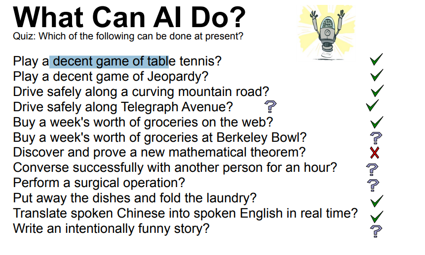
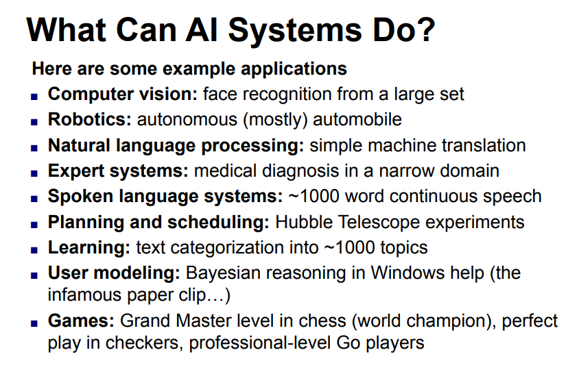
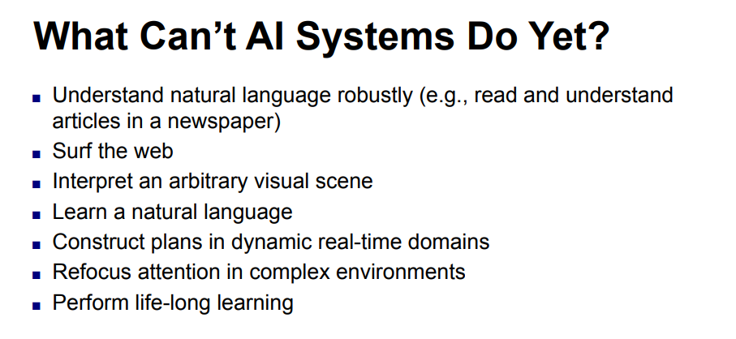
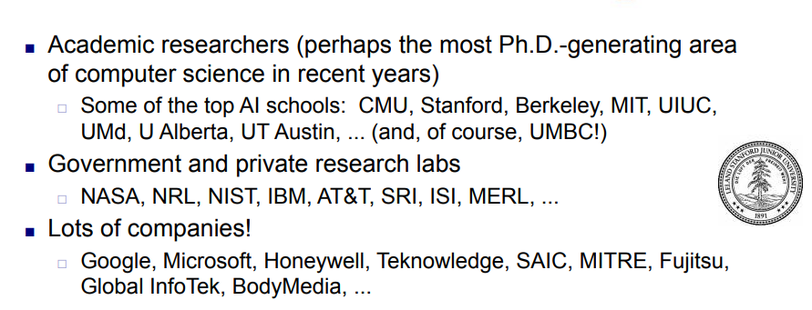
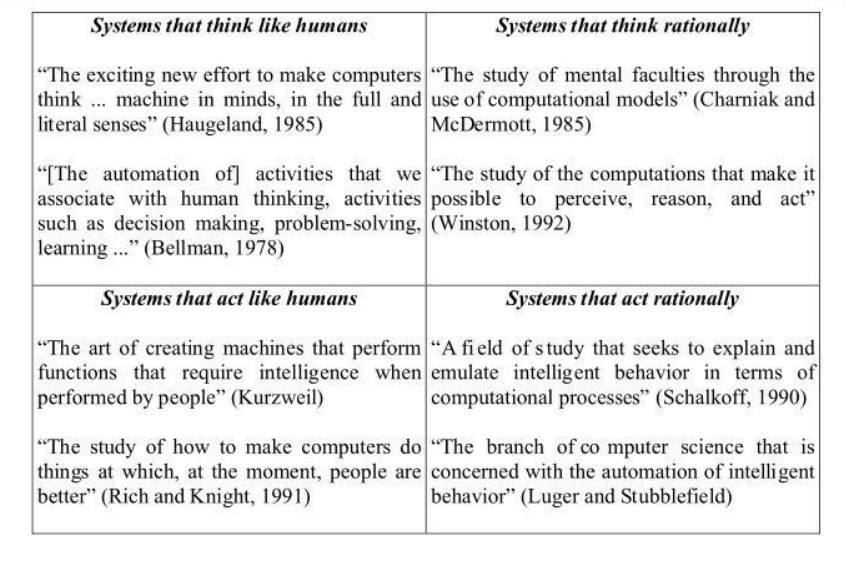

<h1 align="center">CSE0613311 - Artificial Intelligence</h1>

- [1. Introduction to Artificial Intelligence:](#1-introduction-to-artificial-intelligence)
  - [1.1. What is AI:](#11-what-is-ai)
    - [1.1.1. AI Generated(Recommended):](#111-ai-generatedrecommended)
    - [1.1.2. slide copy(Not Recommended):](#112-slide-copynot-recommended)
  - [1.2. Main Goals of AI:](#12-main-goals-of-ai)
    - [1.2.1. AI Generated(Not Recommended):](#121-ai-generatednot-recommended)
    - [1.2.2. Slide copy(Recommended):](#122-slide-copyrecommended)
  - [1.3. Why AI:](#13-why-ai)
    - [1.3.1. AI Generated(Recommended):](#131-ai-generatedrecommended)
    - [1.3.2. Slide copy(Not Recommended):](#132-slide-copynot-recommended)
  - [1.4. Foundation of AI:](#14-foundation-of-ai)
    - [1.4.1. AI Generated + Slide copy(Recommended):](#141-ai-generated--slide-copyrecommended)
  - [1.5. A Short History of AI:](#15-a-short-history-of-ai)
    - [1.5.1. AI Generated + Slide copy(Recommended):](#151-ai-generated--slide-copyrecommended)
  - [1.6. What Can AI Do:](#16-what-can-ai-do)
    - [1.6.1. AI Generated (Recommended):](#161-ai-generated-recommended)
    - [1.6.2. Slide copy(Not Recommended):](#162-slide-copynot-recommended)
  - [1.7. What Can’t AI Systems Do Yet:](#17-what-cant-ai-systems-do-yet)
    - [1.7.1. AI Generated (Recommended):](#171-ai-generated-recommended)
    - [1.7.2. Slide copy(Not Recommended):](#172-slide-copynot-recommended)
  - [1.8. Big Questions:](#18-big-questions)
    - [1.8.1. AI Generated (Recommended):](#181-ai-generated-recommended)
  - [1.9. Who Does AI:](#19-who-does-ai)
    - [1.9.1. AI Generated (Recommended):](#191-ai-generated-recommended)
    - [1.9.2. Slide copy(Not Recommended):](#192-slide-copynot-recommended)
  - [1.10. Four Goals of AI:](#110-four-goals-of-ai)
    - [1.10.1. AI Generated (Recommended):](#1101-ai-generated-recommended)
    - [1.10.2. Slide copy(Not Recommended):](#1102-slide-copynot-recommended)
  - [1.11. Whta is Turing Test \& Loebner Test:](#111-whta-is-turing-test--loebner-test)
    - [1.11.1. AI Generated (Recommended):](#1111-ai-generated-recommended)
  - [1.12. Purpose of Turing Test \& Loebner Test:](#112-purpose-of-turing-test--loebner-test)
    - [1.12.1. AI Generated (Recommended):](#1121-ai-generated-recommended)
  - [1.13. How Turing Test \& Loebner Test Work:](#113-how-turing-test--loebner-test-work)
  - [1.14. What is Heuristic System:](#114-what-is-heuristic-system)
    - [1.14.1. AI Generated (Recommended):](#1141-ai-generated-recommended)
  - [1.15. Reasoning Areas Where AI is Used:](#115-reasoning-areas-where-ai-is-used)
    - [1.15.1. AI Generated (Recommended):](#1151-ai-generated-recommended)
  - [1.16. Strong AI vs Weak AI:](#116-strong-ai-vs-weak-ai)
    - [1.16.1. AI Generated (Recommended):](#1161-ai-generated-recommended)

# 1. Introduction to Artificial Intelligence:

slide pdf: [Click Here](./assets/pdf/01_Introduction%20to%20Artificial%20Intelligence.pptx.pdf)

## 1.1. What is AI:
### 1.1.1. AI Generated(Recommended):
Artificial Intelligence (AI) is a branch of computer science that creates systems that capable of learning, reasoning, problem-solving, and making decisions in ways that normally require human intelligence.

### 1.1.2. slide copy(Not Recommended):
Artificial intelligence (AI) is the simulation of human intelligence processes by machines, especially computer systems. These processes include learning (the acquisition of information and rules for using the information), reasonin (using rules to reach approximate or definite conclusions) and self-correction.

## 1.2. Main Goals of AI: 

### 1.2.1. AI Generated(Not Recommended):
- Learning
- Reasoning
- Problem-Solving
- Perception
- Natural Language Understanding
- Decision-Making
- Automation
- Creating Intelligent Agents

### 1.2.2. Slide copy(Recommended):
- Represent and store knowledge
- Retrieve and reason about knowledge
- Behave intelligently in complex environments
- Develop interesting and useful applications
- Interact with people, agents, and the environment

## 1.3. Why AI:
### 1.3.1. AI Generated(Recommended):
- Automation: Automates repetitive and time-consuming tasks.
- Efficiency: Performs tasks faster and more efficiently than humans.
- Accuracy: Reduces human errors and improves consistency.
- Data Analysis: Processes and analyzes large amounts of data to find useful insights.
- Decision-Making: Helps humans make better decisions by providing intelligent recommendations.

### 1.3.2. Slide copy(Not Recommended):
- Engineering: To get machines to do a wider variety of useful things e.g., understand spoken natural language, recognize individual people in visual scenes, find the best travel plan for your vacation, etc.
- Cognitive Science: As a way to understand how natural minds and mental phenomena work e.g., visual perception, memory, learning, language, etc.
- Philosophy: As a way to explore some basic and interesting (and important) philosophical questions e.g., the mind body problem, what is consciousness, etc.

## 1.4. Foundation of AI:
### 1.4.1. AI Generated + Slide copy(Recommended):
- Computer Science & Engineering
- Mathematics
- Psychology & Cognitive Science
- Philosophy
- Biology
- Neuroscience
- Linguistics
- economics

## 1.5. A Short History of AI:
### 1.5.1. AI Generated + Slide copy(Recommended):

| Year          | Milestone                           |
| ------------- | ----------------------------------- |
| 1943          | First artificial neuron model       |
| 1950          | Turing Test proposed                |
| 1956          | Birth of AI at Dartmouth Conference |
| 1970s–1980s   | Expert Systems                      |
| 1988–1993     | AI Winter                           |
| 1990s         | Statistical AI                      |
| 2010s–Present | Deep Learning & Generative AI       |

## 1.6. What Can AI Do:
### 1.6.1. AI Generated (Recommended):
- Learn from data
- Solve problems
- Understand language
- Recognize images and speech
- Make decisions
- Automate tasks
- Make predictions

### 1.6.2. Slide copy(Not Recommended):

## 1.7. What Can’t AI Systems Do Yet:

### 1.7.1. AI Generated (Recommended):
- Truly understand like humans.
- Possess consciousness or self-awareness.
- Think and reason like humans in every situation.
- Make perfect decisions.
- Fully replace humans.

### 1.7.2. Slide copy(Not Recommended):

## 1.8. Big Questions: 

### 1.8.1. AI Generated (Recommended):

| Question                           | Simple Answer                                                                                                      |
| ---------------------------------- | ------------------------------------------------------------------------------------------------------------------ |
| Can machines think?                | AI researchers debate this; machines can perform intelligent tasks, but whether they truly think is controversial. |
| If so, how?                        | By processing information, learning from data, and making decisions using algorithms.                              |
| If not, why not?                   | Because they lack consciousness, emotions, and true understanding.                                                 |
| What does this say about humans?   | It helps us understand what makes human intelligence unique.                                                       |
| What does this say about the mind? | It raises questions about whether the mind works like a computer and whether consciousness can be replicated.      |

## 1.9. Who Does AI:
### 1.9.1. AI Generated (Recommended):

- AI researchers / scientists: Design new AI theories, algorithms, and models to improve intelligence systems.
- Software engineers: Build and implement AI applications and turn research ideas into real-world software.
- Data scientists: Collect, clean, and analyze data to train AI models and improve their accuracy.
- Technology companies: Develop, deploy, and scale AI products for real users (apps, services, tools).
- Universities and research labs: Conduct academic research, discover new AI methods, and train future experts.

### 1.9.2. Slide copy(Not Recommended):

## 1.10. Four Goals of AI:
### 1.10.1. AI Generated (Recommended):
- Learning: Enable machines to learn from data and improve performance over time.
- Reasoning: Allow machines to make logical decisions based on available information.
- Problem Solving: Help machines find solutions to complex or real-world problems.
- Perception: Enable machines to understand and interpret input from the environment (images, sound, text).

### 1.10.2. Slide copy(Not Recommended):

## 1.11. Whta is Turing Test & Loebner Test: 

### 1.11.1. AI Generated (Recommended):
- Turing Test: The Turing Test was proposed by Alan Turing. It is a test to check whether a machine can show human-like intelligence in conversation.
- Loebner Test: The Loebner Test (Loebner Prize Competition) is a real-world version of the Turing Test. Means it is an annual competition where judges interact with both humans and AI chat systems.

## 1.12. Purpose of Turing Test & Loebner Test:

### 1.12.1. AI Generated (Recommended):
- Turing Test: To evaluate whether a machine can imitate human intelligence well enough to be indistinguishable from a human in conversation.
- Loebner Test: To measure how closely AI can simulate human conversation in practice.

## 1.13. How Turing Test & Loebner Test Work:
- Turing Test: A human judge chats with two hidden participants: one human and one machine (AI). If the judge cannot reliably tell which one is the machine, the AI is said to pass the test.
- Loebner Test: Judges have conversations and try to identify which participant is the machine. The AI that most closely mimics human conversation performs best.

## 1.14. What is Heuristic System: 
### 1.14.1. AI Generated (Recommended):
A heuristic system is an AI approach that solves problems using experience-based rules or “rules of thumb” instead of trying every possible solution. For example: 
- In chess AI, instead of analyzing every possible move, the system uses heuristics to choose strong moves quickly.
- In GPS navigation, it quickly finds a good route instead of checking all possible routes.

## 1.15. Reasoning Areas Where AI is Used: 
### 1.15.1. AI Generated (Recommended):
- Medical diagnosis (finding diseases)
- Expert systems (decision support in law, finance, medicine)
- Game playing (chess, strategy games)
- Planning & scheduling (delivery routes, logistics)
- Natural language reasoning (chatbots, Q&A systems)

## 1.16. Strong AI vs Weak AI: 
### 1.16.1. AI Generated (Recommended):
| Feature       | Weak AI               | Strong AI                              |
| ------------- | --------------------- | -------------------------------------- |
| Scope         | Limited tasks         | Any task like humans                   |
| Intelligence  | Narrow                | General                                |
| Understanding | No real understanding | Human-like understanding (theoretical) |
| Existence     | Exists today          | Not yet built                          |
